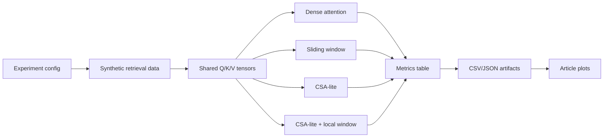

# feat: Build LiteKV attention demo

## Overview

Build LiteKV as a small Python/PyTorch demo that supports the DeepSeek-V4 technical article. The demo should not claim to reproduce DeepSeek-V4; it should generate evidence for the article's mechanism-level argument: dense attention becomes expensive with longer context, sliding window is cheap but weak for remote retrieval, and a simplified "compressed remote KV + sparse top-k block selection + local window" design can reduce theoretical compute/KV cache while preserving a measurable retrieval signal.

## Problem Frame

The project currently has a clear technical validation document but no code. The goal is to create an executable demo that can produce article-ready tables and plots for 512, 1K, 2K, and 4K context lengths on an M1-class machine. The demo should prioritize interpretability, reproducibility, and clear boundaries over model quality.

The core product of the implementation is a repeatable evidence chain for a technical sharing article:

- Explain why long-context attention is expensive.
- Compare dense attention, sliding window, CSA-lite, and CSA-lite + local window.
- Show cost and retrieval trade-offs with small, local experiments.
- Keep claims scoped to mechanism validation, not official DeepSeek-V4 capability reproduction.

## Requirements Trace

- R1. Provide four comparable attention modes: dense, sliding window, CSA-lite, and CSA-lite + local window.
- R2. Measure KV cache size, theoretical attention FLOPs, forward latency, selected block counts, and retrieval accuracy/recall.
- R3. Support context lengths 512, 1K, 2K, and 4K with M1-friendly defaults.
- R4. Generate reproducible synthetic passkey / needle-style data or constructed attention-level retrieval cases.
- R5. Export article-ready CSV/JSON results and plots under `results/`.
- R6. Make the implementation honest about scope: LiteKV validates mechanism-level trade-offs, not DeepSeek-V4 official 1M context behavior.

## Scope Boundaries

- Do not reproduce DeepSeek-V4, DSA, HCA, MoE, FP formats, TileLang kernels, context parallelism, or official model weights.
- Do not require cloud GPU, CUDA-only kernels, or large model training.
- Do not make M1 latency numbers sound like production throughput claims.
- Do not make retrieval accuracy from synthetic tasks stand in for real benchmark performance.
- Do not depend on a long training loop for the first useful article figures.

### Deferred to Separate Tasks

- Full toy decoder-only training: keep the code structure compatible with a toy model, but the MVP should be able to produce mechanism-validation figures without relying on training convergence.
- LongBench / RULER-style evaluation: defer until the local mechanism demo is stable.
- Polished article draft: this plan creates demo evidence and helper notes; the final article prose can follow after results are generated.

## Context & Research

### Relevant Code and Patterns

- The repository is currently a greenfield project with empty `src/`, `experiments/`, `data/`, `results/`, and `notes/` directories.
- The primary existing artifact is `DeepSeek-V4技术拆解与LiteKV验证方案.md`, which defines LiteKV as a demo for a DeepSeek-V4 technical article.
- No `pyproject.toml`, `requirements.txt`, tests, package layout, or existing implementation patterns are present.

### Institutional Learnings

- No `docs/solutions/` knowledge base exists in this repository, so there are no local institutional learnings to apply.

### External References

- Hugging Face DeepSeek-V4 article: `https://huggingface.co/blog/deepseekv4`
- DeepSeek API news page: `https://api-docs.deepseek.com/news/news260424`
- PyTorch MPS documentation: `https://pytorch.org/docs/stable/notes/mps.html`
- PyTorch scaled dot product attention documentation: `https://pytorch.org/docs/stable/generated/torch.nn.functional.scaled_dot_product_attention.html`

External research implication: the plan should favor plain, inspectable PyTorch operations and theoretical accounting. MPS can be supported as a device option, but optimized attention kernels and latency conclusions should not be treated as portable DeepSeek-like performance evidence.

## Key Technical Decisions

- Use Python with PyTorch: PyTorch gives tensor operations, CPU/MPS portability, and enough familiarity for readers to inspect the attention mechanisms.
- Build an attention-level MVP before a trained LM: cost and sparse-retrieval mechanics can be validated with constructed tensors and synthetic targets, avoiding a fragile dependency on toy model convergence.
- Keep four attention modes behind one shared interface: shared inputs and metrics make comparisons fair and make plots easier to explain in the article.
- Separate theoretical metrics from measured latency: FLOPs/KV cache formulas support architecture reasoning, while M1 latency remains a local sanity check.
- Store experiment outputs as data first, plots second: CSV/JSON outputs make claims auditable and allow plot regeneration.
- Use deterministic seeds and small defaults: article figures must be reproducible on a laptop.

## Open Questions

### Resolved During Planning

- Should the demo be a standalone project or article support artifact? It should be an article support artifact; LiteKV is the "experimental microscope," not the article's main subject.
- Should first success require training a toy LM? No. The first milestone should use attention-level retrieval and cost experiments, with toy decoder integration layered afterward.
- Should MPS be mandatory? No. CPU should work everywhere; MPS is an optional acceleration path on Apple Silicon.

### Deferred to Implementation

- Exact package/dependency versions: choose during setup based on installed Python and PyTorch availability.
- Exact latency timing method: implementation should select a simple, repeatable timer and handle MPS synchronization if available.
- Exact CSA-lite compression operator: start with mean pooling over KV blocks; consider learned projection only after the baseline evidence exists.
- Exact article plot styling: first generate clear, labeled plots; refine visual style after seeing actual data ranges.

## Output Structure

    .
    |-- pyproject.toml
    |-- README.md
    |-- DeepSeek-V4技术拆解与LiteKV验证方案.md
    |-- docs/plans/2026-04-27-001-feat-litekv-demo-plan.md
    |-- src/litekv/
    |   |-- __init__.py
    |   |-- attention.py
    |   |-- config.py
    |   |-- data.py
    |   |-- experiment.py
    |   |-- metrics.py
    |   |-- model.py
    |   |-- plots.py
    |   `-- timing.py
    |-- experiments/
    |   |-- configs/default.yaml
    |   `-- run_litekv.py
    |-- tests/
    |   |-- test_attention.py
    |   |-- test_data.py
    |   |-- test_experiment.py
    |   |-- test_metrics.py
    |   |-- test_model.py
    |   `-- test_plots.py
    `-- results/

## High-Level Technical Design

> *This illustrates the intended approach and is directional guidance for review, not implementation specification. The implementing agent should treat it as context, not code to reproduce.*

The implementation should keep the same synthetic case, context length, hidden size, number of heads, and seed across attention modes so that differences are attributable to the attention mechanism rather than experiment setup.

## Phased Delivery

### Phase 1: Article Evidence MVP

Complete Units 1-5 first. At the end of this phase, the repo should produce metrics files, plots, and article-facing interpretation notes without requiring toy model training.

### Phase 2: Optional Model Wrapper

Complete Unit 6 only after the attention-level evidence path is stable. This keeps the demo aligned with the article goal and prevents model-training complexity from blocking the first usable results.

## Implementation Units

- [x] **Unit 1: Project scaffold and configuration**

**Goal:** Establish a minimal Python package, dependency metadata, config model, and CLI entry point shape.

**Requirements:** R3, R5, R6

**Dependencies:** None

**Files:**
- Create: `pyproject.toml`
- Create: `README.md`
- Create: `src/litekv/__init__.py`
- Create: `src/litekv/config.py`
- Create: `experiments/configs/default.yaml`
- Create: `experiments/run_litekv.py`
- Test: `tests/test_experiment.py`

**Approach:**
- Define a small config surface for context lengths, hidden size, heads, batch size, compression ratio, top-k values, local window sizes, seed, device, and output directory.
- Keep defaults M1-friendly and aligned with `DeepSeek-V4技术拆解与LiteKV验证方案.md`.
- Make CPU the guaranteed fallback and MPS an optional device choice.
- Keep the CLI focused on running the default experiment and writing results, not on becoming a general training framework.

**Execution note:** Start with a small test that loads the default config and validates the expected context lengths and attention modes before wiring implementation details.

**Patterns to follow:**
- Greenfield repository; use straightforward module names and keep public objects easy to import from tests.

**Test scenarios:**
- Happy path: loading `experiments/configs/default.yaml` returns context lengths `[512, 1024, 2048, 4096]` and all four attention modes.
- Happy path: default config resolves `results/` as the output directory without requiring it to already contain files.
- Edge case: requesting `mps` on a machine where MPS is unavailable falls back cleanly or reports a clear unsupported-device message.
- Error path: invalid compression ratio such as `0` is rejected before experiments run.

**Verification:**
- A developer can install the project in editable mode, import `litekv`, and load the default experiment configuration.

- [x] **Unit 2: Synthetic retrieval data and constructed attention cases**

**Goal:** Generate deterministic synthetic cases that make remote retrieval measurable without requiring large-scale training.

**Requirements:** R2, R3, R4

**Dependencies:** Unit 1

**Files:**
- Create: `src/litekv/data.py`
- Test: `tests/test_data.py`

**Approach:**
- Provide synthetic passkey / needle-style metadata: target position, target block, query position, and expected retrieval target.
- Build constructed Q/K/V tensors where the relevant remote token or block has a controllable similarity signal.
- Support target positions across early, middle, and late context regions to show where sliding window fails.
- Keep data generation deterministic with explicit seeds so article figures can be regenerated.

**Technical design:** The generator should expose two layers: human-readable synthetic task metadata for article explanation, and tensor-level Q/K/V cases for reliable mechanism evaluation.

**Patterns to follow:**
- Use simple tensor shapes and named result fields; avoid hiding experiment meaning behind abstract dataset classes.

**Test scenarios:**
- Happy path: generating the same case twice with the same seed produces identical target positions and tensors.
- Happy path: a target placed outside a 128-token sliding window is marked as unreachable by that window.
- Edge case: context length smaller than the local window is handled without negative ranges.
- Edge case: target positions near the beginning and end of context produce valid target block ids.
- Error path: non-divisible context length and compression ratio either pad explicitly or raise a clear validation error.

**Verification:**
- The generated cases can be inspected and explain which remote token/block each attention mode should retrieve.

- [x] **Unit 3: Attention implementations and theoretical accounting**

**Goal:** Implement dense, sliding window, CSA-lite, and CSA-lite + local window attention modes with shared inputs and comparable metrics.

**Requirements:** R1, R2, R3, R6

**Dependencies:** Unit 2

**Files:**
- Create: `src/litekv/attention.py`
- Create: `src/litekv/metrics.py`
- Create: `src/litekv/timing.py`
- Test: `tests/test_attention.py`
- Test: `tests/test_metrics.py`

**Approach:**
- Implement dense attention as the correctness and cost baseline.
- Implement sliding window as a mask over recent tokens.
- Implement CSA-lite by mean-pooling K/V blocks of size `m`, scoring query against compressed block keys, selecting top-k blocks, and attending only to selected compressed values.
- Implement CSA-lite + local window by combining selected remote compressed blocks with uncompressed local tokens.
- Report theoretical KV entries, estimated KV bytes, attention score counts/FLOPs, selected block count, retrieval hit/recall, and measured forward latency.
- Keep measured latency separate from theoretical metrics and label it as local machine evidence.

**Technical design:** The attention interface should return both output tensors and a structured metrics object so experiment code does not need to introspect internal tensors.

**Patterns to follow:**
- Prefer explicit tensor transformations over opaque optimized kernels; the demo's purpose is explanation and auditability.

**Test scenarios:**
- Happy path: dense attention can retrieve a constructed target when the target has the strongest similarity.
- Happy path: sliding window misses a constructed target outside the configured window.
- Happy path: CSA-lite selects the target block when top-k includes the block with the strongest compressed similarity.
- Happy path: CSA-lite + local window includes both selected remote blocks and uncompressed local tokens in its accounting.
- Edge case: `top_k` larger than available compressed blocks is capped or handled clearly.
- Edge case: local window larger than context length behaves like full local coverage.
- Error path: unknown attention mode raises a clear validation error.
- Integration: all four modes accept the same Q/K/V case and return metrics with the same schema.

**Verification:**
- Tests prove the four modes are comparable and produce expected retrieval/cost behavior on constructed cases.

- [x] **Unit 4: Experiment runner and result artifacts**

**Goal:** Run the full matrix of context lengths, modes, top-k values, and local window settings, then write auditable result files.

**Requirements:** R2, R3, R4, R5

**Dependencies:** Unit 3

**Files:**
- Create: `src/litekv/experiment.py`
- Modify: `experiments/run_litekv.py`
- Test: `tests/test_experiment.py`

**Approach:**
- Treat experiments as a data pipeline: config in, deterministic cases generated, attention modes evaluated, structured rows written out.
- Write machine-readable artifacts such as `results/metrics.csv` and `results/metrics.json`.
- Include metadata fields: seed, device, context length, hidden size, heads, compression ratio, top-k, local window, mode, and timestamp.
- Keep runtime bounded by default; allow smaller smoke-test configs for tests.

**Execution note:** Add a fast smoke config path for tests rather than making tests run the full 4K experiment matrix.

**Patterns to follow:**
- Keep experiment orchestration thin; core behavior belongs in `data.py`, `attention.py`, and `metrics.py`.

**Test scenarios:**
- Happy path: a smoke experiment with two context lengths and two modes writes CSV/JSON rows with expected columns.
- Happy path: repeated runs with the same seed produce identical deterministic metric fields, excluding run timestamp fields.
- Edge case: `results/` does not exist before the run and is created safely.
- Error path: invalid mode in the config fails before partial result files are written.
- Integration: experiment rows include theoretical metrics and measured latency for every configured mode/context pair.

**Verification:**
- Running the default experiment produces result artifacts that can be used directly by plotting code and article analysis.

- [x] **Unit 5: Plotting and article-facing outputs**

**Goal:** Convert result artifacts into clear plots and short markdown notes for the DeepSeek-V4 article.

**Requirements:** R2, R5, R6

**Dependencies:** Unit 4

**Files:**
- Create: `src/litekv/plots.py`
- Create: `notes/article_results_template.md`
- Test: `tests/test_plots.py`

**Approach:**
- Generate the five planned figures: KV cache vs context, FLOPs vs context, latency vs context, retrieval accuracy/recall, and top-k trade-off.
- Save plots under `results/` with stable filenames.
- Include labels that make scope clear, for example "LiteKV synthetic demo" and "local M1 timing".
- Create a markdown template that tells the article author what each plot can and cannot claim.

**Patterns to follow:**
- Keep plot generation deterministic and regenerate from saved metrics instead of rerunning experiments.

**Test scenarios:**
- Happy path: plotting from a tiny fixture metrics file creates all expected plot files.
- Happy path: missing optional top-k sweep data skips the top-k plot with a clear warning instead of failing all plots.
- Edge case: empty metrics input raises a clear error.
- Integration: generated filenames match the names promised in `DeepSeek-V4技术拆解与LiteKV验证方案.md`.

**Verification:**
- Article-facing files exist under `results/`, and `notes/article_results_template.md` explains how to interpret them without overstating claims.

- [ ] **Unit 6: Optional toy decoder wrapper**

**Goal:** Provide a small decoder-only wrapper that can demonstrate where the attention modules would sit in a toy Transformer, without making training a blocker for the MVP.

**Requirements:** R1, R4, R6

**Dependencies:** Unit 3

**Files:**
- Create: `src/litekv/model.py`
- Test: `tests/test_model.py`

**Approach:**
- Build a minimal decoder block only after the attention modes and metrics are stable.
- Use it to show architectural placement of dense/sliding/CSA-lite attention, not to claim production-quality model results.
- Keep this unit optional for the first article figures if attention-level experiments already prove the mechanism claims.

**Patterns to follow:**
- Reuse the same attention mode interface from Unit 3; do not duplicate attention logic in the model wrapper.

**Test scenarios:**
- Happy path: a toy decoder block can run a forward pass with dense attention on a tiny sequence.
- Happy path: the same wrapper can swap to CSA-lite mode through config.
- Edge case: sequence shorter than the local window still returns valid output shape.
- Error path: unsupported attention mode fails with the same validation path as Unit 3.

**Verification:**
- The toy wrapper demonstrates integration without slowing down the MVP or changing the article's evidence boundary.

## System-Wide Impact

- **Interaction graph:** Config drives data generation, data generation feeds attention modes, attention metrics feed experiment artifacts, and artifacts feed plots/article notes.
- **Error propagation:** Config validation should fail early; experiment failures should not silently produce partial or misleading plots.
- **State lifecycle risks:** Result files should include enough metadata to distinguish runs and avoid mixing incompatible experiment settings.
- **API surface parity:** All attention modes should expose the same callable interface and metrics schema.
- **Integration coverage:** Smoke tests should cover the path from config to generated metric rows to plots.
- **Unchanged invariants:** The root validation document remains the statement of scope; code should not broaden claims beyond it.

## Risks & Dependencies

| Risk | Mitigation |
|------|------------|
| Training a toy LM consumes time without stable results | Make attention-level synthetic retrieval the MVP; keep training optional |
| CSA-lite simplification is mistaken for official DSA | Name it CSA-lite, document limitations, and include "not a reproduction" language in README and article notes |
| M1 latency is noisy or misleading | Separate theoretical metrics from measured latency and label latency as local evidence only |
| MPS support differs from CPU behavior | Require CPU correctness tests and treat MPS as optional acceleration |
| Top-k retrieval looks good only on overly constructed data | Include target positions across early/middle/late context and report the synthetic nature clearly |
| Result artifacts become hard to audit | Save CSV/JSON with config metadata and deterministic seeds |

## Documentation / Operational Notes

- `README.md` should explain the project boundary in the first screen: LiteKV is a DeepSeek-V4 article demo, not a DeepSeek-V4 reproduction.
- `notes/article_results_template.md` should include safe phrasing for article claims and explicit non-claims.
- Generated plots should be stable enough to embed in a technical sharing article.

## Sources & References

- **Origin document:** `DeepSeek-V4技术拆解与LiteKV验证方案.md`
- **External reference:** `https://huggingface.co/blog/deepseekv4`
- **External reference:** `https://api-docs.deepseek.com/news/news260424`
- **External reference:** `https://pytorch.org/docs/stable/notes/mps.html`
- **External reference:** `https://pytorch.org/docs/stable/generated/torch.nn.functional.scaled_dot_product_attention.html`
